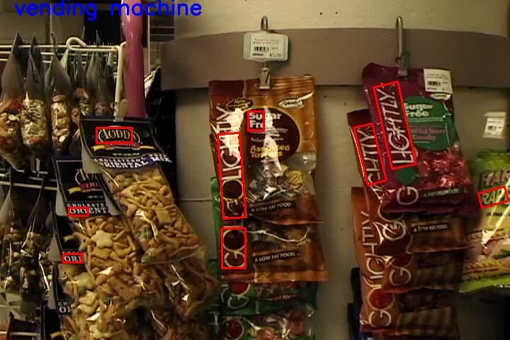
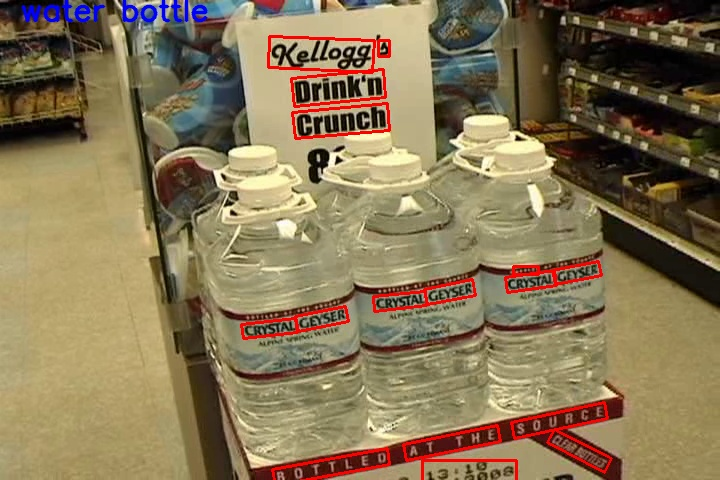
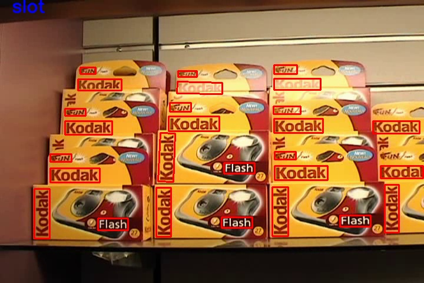

# Detecting Vairous products in A Retail Shop

### Challenges 
- Thousands of products and hundreds of vaients of different product
- Cannot label different products individually 
- Text is found in various fonts, orientation and sizes
- Each frame of video has to be processed 

### Strategy
- We to use written content on product
- We also use object classification of different images in imagenet 
- It would be possible to map the classification and text to product in a catalogue(for a real case scenario)

### Solutions
- Using imagenet trained model 
- Using CRAFT to read labels and texts on  each products

### Results

### Replication 
- Use requirement.txt to install dependencies 
- Also download 'craft_mlt_25k.pth' 
- Read about CRAFT algorithm if problem arises 

### Limitations 
- Best suited for single photo, as the CRAFT method is slow in CPU 
 
### Future Work 
- To create a faster working algorithm than CRAFT

